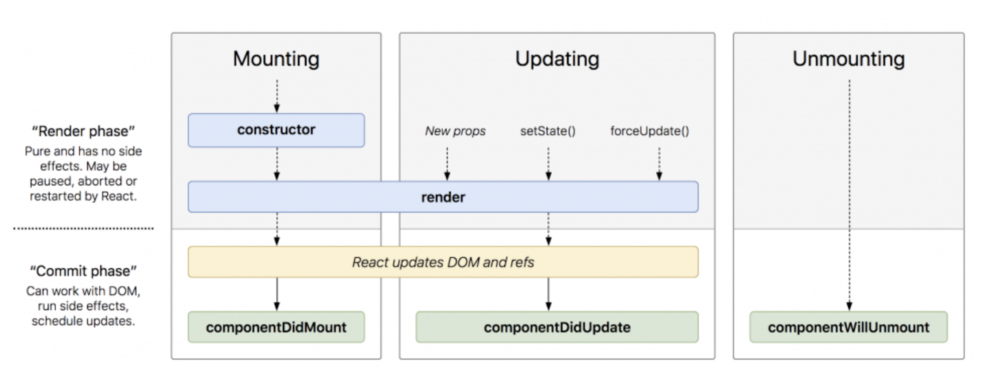

2020-06-01 22:33:32

# react hooks survey
## コンポーネントのライフサイクル
- mounting
- updating
- unmounting



from react class to functional component

- state, setState(...) -> React.useState(...)
- componentWillMount -> code before jsx
- componentDidMount -> React.useEffect(()=>{},[])
- componentDidUpdate -> React.useEffect(()=>{},[...dependencies])
- shouldComponentUpdate -> React.memo(Component, () => {})
- componentWillUnmount -> React.useEffect(()=>{ return () => {} } ,[])

function component の再描画

> functionコンポーネントはJSXとして読み込まれた際に最初の描画が行われます。
>
> そして、アプリケーション内で以下の変化が発生したタイミングで再描画されます。
>
> 親コンポーネントが再描画された時
> 親コンポーネントから引き渡されているpropsが変化した時
> コンポーネント内でuseStateで定義している変数が変化した時
> カスタムフックより受け取っている変数が変化した時
> 再描画の際にコンポーネントは初回と同じ処理が実行されるのではなく一部の処理は前回のコンポーネントの状態を引き継ぎます。
>
> たとえばuseStateで値が変化されている状態で再描画が発生すると、useStateで取得される値は初期値ではなく、最後にコンポーネントが保有していた値になります。

cf.
- [【Reactの設計を学ぶ】ライフサイクルを知ろう \| CodeShip blog](https://code-ship-blog.wemotion.co.jp/technology/%E3%80%90react%E3%81%AE%E8%A8%AD%E8%A8%88%E3%82%92%E5%AD%A6%E3%81%B6%E3%80%91%E3%83%A9%E3%82%A4%E3%83%95%E3%82%B5%E3%82%A4%E3%82%AF%E3%83%AB%E3%82%92%E7%9F%A5%E3%82%8D%E3%81%86/)
- [useEffect / React Hooks – React入門 \- to\-R Media](https://www.to-r.net/media/react-tutorial-hooks-useeffect/)

## コンポーネントのレンダリングについて
- 内部状態またはプロパティが変更されると、コンポーネントの関数が再実行される。
- 関数の結果が前回の呼び出し時と同じであれば、レンダリングは発生しない。
- レンダリングが完了すると、useEffect が実行される。

cf.
- おすすめ: [関数型Reactコンポーネントでレンダリングと副作用Hookが実行されるタイミング \| Hypertext Candy](https://www.hypertextcandy.com/when-hook-is-called)
- [Reactのレンダリングに関する完全ガイド \- Qiita](https://qiita.com/hellokenta/items/6b795501a0a8921bb6b5)

## hooks のルール
> - フックは関数のトップレベルのみで呼び出してください。ループや条件分岐やネストした関数の中でフックを呼び出さないでください。
> - フックは React の関数コンポーネントの内部のみで呼び出してください。通常の JavaScript 関数内では呼び出さないでください（ただしフックを呼び出していい場所がもう 1 カ所だけあります — 自分のカスタムフックの中です。これについてはすぐ後で学びます）。
https://ja.reactjs.org/docs/hooks-overview.html#rules-of-hooks

## keywords
- レンダリング: react が DOM を更新すること
- ライフサイクル: DOM を更新して、 次に DOM を更新するまでの間のこと
- コンポーネント: virtual DOM の一部を react ではコンポーネントという単位で扱う

## useState
component の1ライフサイクル(1レンダリング)内で状態を保持するために使う

ex.
``` typescript
const [count, setCount] = useState(0);
```

cf.
- [ステートフックの利用法 – React](https://ja.reactjs.org/docs/hooks-state.html)

## useEffect: 副作用を扱う hooks
- レンダリング後に起こしたい処理を記述するときに使う
- 再レンダリングのときに特定の値の状態が変わってない場合は副作用をスキップできる

- コンポーネントの内部状態が変化したらコンポーネントが実行される
- コンポーネントが実行され、JSX の値に変化があったら DOM のレンダリングが走る
- DOM がレンダリングされたら、 useEffect が呼ばれる

クリーンアップを必要としない副作用
- React が DOM を更新した後で追加のコードを実行したい

レンダリング後に毎回副作用が呼ばれる
ex.
``` typescript
useEffect(() => {
  document.title = `You clicked ${count} times`;
});
```

クリーンアップを必要とする副作用
- React が DOM を更新した後で追加のコードを実行し、コンポーネントがアンマウントされるときにクリーンアップの副作用を実行する

useEffect で return された副作用はコンポーネントがアンマウントされるときに実行される
``` typescript
useEffect(() => {
  function handleStatusChange(status) {
    setIsOnline(status.isOnline);
  }
  ChatAPI.subscribeToFriendStatus(props.friend.id, handleStatusChange);
  // Specify how to clean up after this effect:
  return function cleanup() {
    ChatAPI.unsubscribeFromFriendStatus(props.friend.id, handleStatusChange);
  };
});
```

count が変更したときだけ実行される
ex.
``` typescript
useEffect(() => {
  document.title = `You clicked ${count} times`;
  return () => hogehoge
}, [count]); // Only re-run the effect if count changes
```

はじめのレンダリングのときだけ実行される
ex.
``` typescript
useEffect(() => {
  document.title = `hoge`;
  return () => hogehoge
}, []); // run the effect when first rendering
```


cf.
- [副作用フックの利用法 – React](https://ja.reactjs.org/docs/hooks-effect.html)

## useContext
> コンテクストオブジェクト（React.createContext からの戻り値）を受け取り、そのコンテクストの現在値を返します。コンテクストの現在値は、ツリー内でこのフックを呼んだコンポーネントの直近にある <MyContext.Provider> の value の値によって決定されます。
> 直近の <MyContext.Provider> が更新された場合、このフックはその MyContext プロバイダに渡された最新の value の値を使って再レンダーを発生させます。祖先コンポーネントが React.memo や shouldComponentUpdate を使っている場合でも、useContext を使っているコンポーネント自体から再レンダーが発生します。

cf.
- [フック API リファレンス – React](https://ja.reactjs.org/docs/hooks-reference.html#usecontext)

### context
コンポーネントにまたがって状態を保持したいときに使う

> アプリケーションの state については、props として渡していくか（より明示的）、あるいはコンテクスト経由で渡すか（深い更新ではより便利）を選ぶ余地が依然あります。もしもコンテクストを使って state も渡すことにする場合は、2 つの別のコンテクストのタイプを使ってください — dispatch のコンテクストは決して変わらないため、dispatch だけを使うコンポーネントは（アプリケーションの state も必要でない限り）再レンダーする必要がなくなります。


``` typescript
// これはそのまま
const ResourceContext = React.createContext("");

export const RootComponent = () => {
  const resource = getResource(); // 何らかの手段で頑張ってサーバから取ってくる。

  return (
    // これもそのまま
    <ResourceContext.Provider value={resource.name}>
      <NavigationComponent />
      <BodyComponent />
    </ResourceContext.Provider>
  );
};

export const NavigationComponent = (props) => {
  // ココ！
  const resourceName = React.useContext(ResourceContext);

  return (
    <header>
      <TitleComponent title={resourceName} />
      <NannkanoButtonComponent  />
      <NannkanoMenuComponent />
    </header>
  );
};
```

cf.
- [コンテクスト – React](https://ja.reactjs.org/docs/context.html)
- [React Context API：状態を簡単に管理する](https://auth0.com/blog/jp-react-context-api-managing-state-with-ease/)
- [React Context（useContext）入門 – the2g](https://the2g.com/2892)
- おすすめ [こんなに簡単なの？React useContextって \| アールエフェクト](https://reffect.co.jp/react/react-usecontext-understanding)
- おすすめ [useContext フックで Consumer をリファクタリングする \- React Context の使い方 \- React の基礎 \- React 入門](https://react.keicode.com/basics/context-usecontext-hook.php)

## useReducer
useState に似てる。 state の state に依存しているみたいなときに使うと良いらしい。

## useMemo, useCallback: メモ化するための hooks
- 文字列、数値、真偽値を変数に代入したら、値そのものが変数に代入される
- 関数、配列、オブジェクトを変数に代入したら、メモリ上のアドレスが変数に代入される
  - 内容が同じであっても生成されるたびにメモリ上のアドレスは異なる

関数、配列、オブジェクトを使う時でも文字列や数値、真偽値のように内容が同じ時は、再レンダリングを避けたいときがある。
それを実現するのが useMemo と useCallback である

- useMemo は配列、オブジェクトに使用する
- useCallback は関数に使用する

cf.
- [useMemoとuseCallback / React Hooks – React入門 \- to\-R Media](https://www.to-r.net/media/react-tutorial-hooks-usememo-usecallback/)

## useRef: コンポーネントの再描画を抑制することができる hooks
Ref オブジェクト: コンポーネントがマウントされたときからアンマウントされるときまで存在し続ける、書き換え可能なオブジェクト


cf.
- [useRef / React Hooks – React入門 \- to\-R Media](https://www.to-r.net/media/react-tutorial-hooks-useref/)
- [React Ref の基本 \- 30歳からのプログラミング](https://numb86-tech.hatenablog.com/entry/2019/12/05/111342)

## react + typescript
- [typescript\-cheatsheets/react\-typescript\-cheatsheet: Cheatsheets for experienced React developers getting started with TypeScript](https://github.com/typescript-cheatsheets/react-typescript-cheatsheet)

## 命名規則
- [\[翻訳\] Airbnb React/JSX Style Guide \- Qiita](https://qiita.com/yamadashy/items/e64762e407b8dd5e0247)

## export
その1
``` typescript
export class Hello implements IHello{
   greeting (name :string){
     return "Hello"+name;
   }
}
```

その2
``` typescript
class Hello implements IHello{
   greeting (name :string){
     return "Hello"+name;
   }
}

export {Hello};

export {Hello as myHello}
```

## key という props は使っちゃだめ
> Warning: Item: key is not a prop. Trying to access it will result in undefined being returned. If you need to access the same value within the child component, you should pass it as a different prop. (https://fb.me/react-special-props)

- [CSS \- react propsの値の渡し方｜teratail](https://teratail.com/questions/190154)

## 状態管理
- [なるべくRedux使いたくないならHooksを学ぼう \- Qiita](https://qiita.com/ShinKano/items/9c07d7b50073a64826c0#%E8%A4%87%E6%95%B0%E3%81%AEstore%E3%82%92%E6%89%B1%E3%81%86)
- [Adios Redux: using React hooks and Context effectively \- DEV](https://dev.to/ankitjena/ciao-redux-using-react-hooks-and-context-effectively-398j)

## react hooks example
- [React Hooks API をふんだんに使ってみた](https://www.cresco.co.jp/blog/entry/8059/)
- [sourcer](https://sourcer.herokuapp.com/)
- react hooks で書き換えたPR [Tried using react hooks by benishouga · Pull Request \#3 · benishouga/sourcer](https://github.com/benishouga/sourcer/pull/3/files)

## FLUX
- [Flux \| Flux](https://facebook.github.io/flux/)
- [fluxのstoreはMVCのモデルではない \- @ledsun blog](https://ledsun.hatenablog.com/entry/2018/05/16/105131)
- [クライアントサイドのモデルとは何か 前編 ~ クライアントサイド MVC の死 \- mizchi's blog](https://mizchi.hatenablog.com/entry/2018/05/15/181819)

## cf.
- [(翻訳) React Hooks は魔法ではなく、ただの配列だ](https://gist.github.com/mizchi/fa00890df2c8d1f27b9ca94b5cb8dd1d)
- [副作用フックの利用法 – React](https://ja.reactjs.org/docs/hooks-effect.html)
- [React Hooks超入門 - Qiita](https://qiita.com/ossan-engineer/items/99739b60b391c8013928)
- [reactでuseStateとuseCallbackを使う - Qiita](https://qiita.com/Climber22/items/2c6103b4e1ef7a1f2f7c)
- [useEffect完全ガイド — Overreacted](https://overreacted.io/ja/a-complete-guide-to-useeffect/)
- [🍋 ⛩️ ✊🏽 React Hooksの概要 🥒 💓 🔖](https://geeks-world.github.io/articles/J429712/index.html)
- [React useEffectを理解する | アールエフェクト](https://reffect.co.jp/react/react-useeffect-understanding)
- [useEffectフックのしくみ - Qiita](https://qiita.com/ossan-engineer/items/740425a0df937a47e093)
- [React Hooks の useEffect の正しい使い方 - Qiita](https://qiita.com/keiya01/items/fc5c725fed1ec53c24c5)
